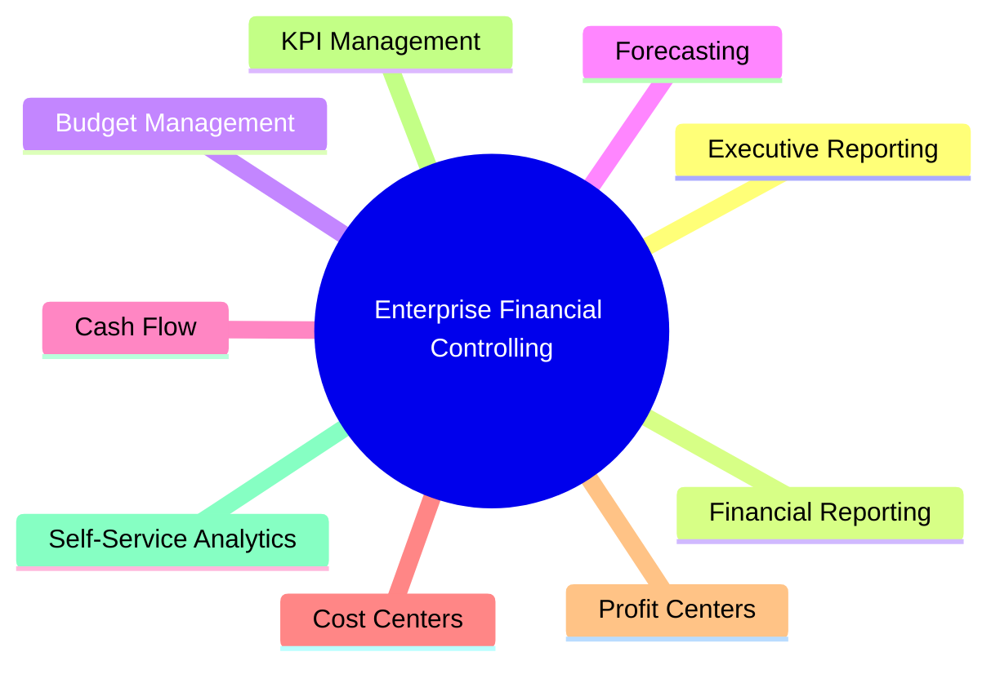

# Business Requirements Document (BRD)

> **Project:** Enterprise Financial Controlling & Management Reporting Solution  
> **Document ID:** SD-01  
> **Version:** 1.0  
> **Status:** Draft  
> **Author:** *Ondřej Seidl*  
> **Last Updated:** July 2026

---

# Document Control

| Field | Value |
|-------|-------|
| Document Name | Business Requirements Document |
| Document ID | SD-01 |
| Version | 1.0 |
| Status | Draft |
| Owner | BI Solution Architect |
| Reviewers | Financial Controller, Product Owner |
| Classification | Internal |

---

# Revision History

| Version | Date | Author | Description |
|----------|------|--------|-------------|
| 1.0 | July 2026 | Your Name | Initial version |

---

# Table of Contents

1. Executive Summary
2. Business Context
3. Business Vision
4. Business Objectives
5. Business Capabilities
6. Stakeholders
7. Scope
8. Functional Requirements
9. Non-Functional Requirements
10. Success Criteria
11. Related Documents

---

# 1. Executive Summary

The **Enterprise Financial Controlling & Management Reporting Solution** is designed to replace fragmented spreadsheet-based financial reporting with a centralized Business Intelligence platform.

The solution will provide management with accurate, timely, and interactive financial information, enabling faster and more informed decision-making.

The platform is designed according to enterprise BI principles and simulates a real-world implementation within a mid-sized manufacturing company.

---

# 2. Business Context

## Current Situation

The finance department currently relies on multiple disconnected reporting processes:

- Excel workbooks
- Manual consolidations
- Department-specific reports
- Static monthly presentations
- Manual variance calculations

These processes create several business challenges:

- inconsistent reporting
- duplicated calculations
- slow reporting cycles
- high risk of human error
- limited transparency
- poor scalability

---

## Business Drivers

The project is initiated to address the following strategic needs:

- Improve financial transparency
- Reduce manual effort
- Increase reporting consistency
- Enable self-service analytics
- Standardize KPI definitions
- Improve executive decision-making
- Build a scalable reporting platform

---

# 3. Business Vision

Create a single, trusted analytical platform that delivers reliable financial information across the organization while supporting operational, tactical, and strategic decision-making.

The platform should become the **Single Source of Truth (SSOT)** for management reporting.

---

# 4. Business Objectives

The project will achieve the following objectives:

| Objective | Priority |
|------------|-----------|
| Automate financial reporting | High |
| Reduce manual reporting | High |
| Improve reporting accuracy | High |
| Budget vs Actual analysis | High |
| Forecast reporting | High |
| Cost center analysis | High |
| Profit center analysis | High |
| Executive dashboards | High |
| Financial KPI standardization | High |
| Self-service reporting | Medium |

---

# Business Vision Diagram

---