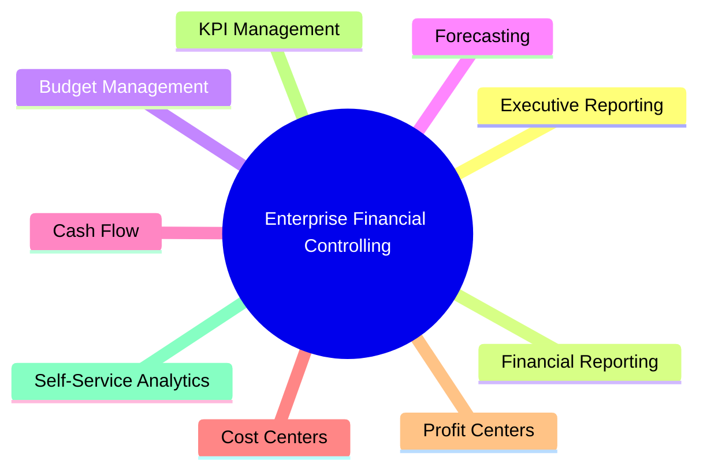
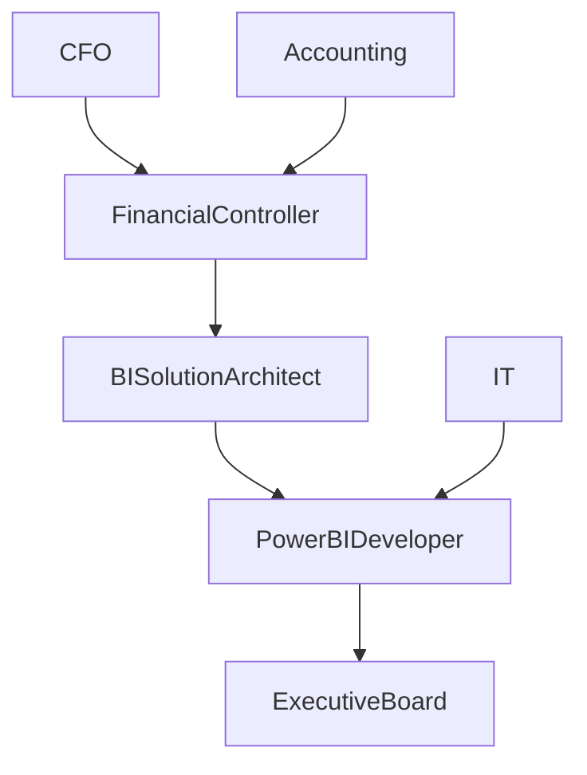
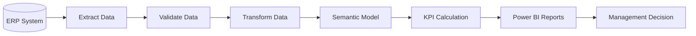

# Business Requirements Document (BRD)

> **Project:** Enterprise Financial Controlling & Management Reporting Solution  
> **Document ID:** SD-01  
> **Version:** 1.0  
> **Status:** Draft  
> **Author:** *Ondřej Seidl*  
> **Last Updated:** July 2026

---

# Document Control

| Field | Value |
|-------|-------|
| Document Name | Business Requirements Document |
| Document ID | SD-01 |
| Version | 1.0 |
| Status | Draft |
| Owner | BI Solution Architect |
| Reviewers | Financial Controller, Product Owner |
| Classification | Internal |

---

# Revision History

| Version | Date | Author | Description |
|----------|------|--------|-------------|
| 1.0 | July 2026 | Your Name | Initial version |

---

# Table of Contents

1. Executive Summary
2. Business Context
3. Business Vision
4. Business Objectives
5. Business Capabilities
6. Stakeholders
7. Scope
8. Functional Requirements
9. Non-Functional Requirements
10. Success Criteria
11. Related Documents

---

# 1. Executive Summary

The **Enterprise Financial Controlling & Management Reporting Solution** is designed to replace fragmented spreadsheet-based financial reporting with a centralized Business Intelligence platform.

The solution will provide management with accurate, timely, and interactive financial information, enabling faster and more informed decision-making.

The platform is designed according to enterprise BI principles and simulates a real-world implementation within a mid-sized manufacturing company.

---

# 2. Business Context

## Current Situation

The finance department currently relies on multiple disconnected reporting processes:

- Excel workbooks
- Manual consolidations
- Department-specific reports
- Static monthly presentations
- Manual variance calculations

These processes create several business challenges:

- inconsistent reporting
- duplicated calculations
- slow reporting cycles
- high risk of human error
- limited transparency
- poor scalability

---

## Business Drivers

The project is initiated to address the following strategic needs:

- Improve financial transparency
- Reduce manual effort
- Increase reporting consistency
- Enable self-service analytics
- Standardize KPI definitions
- Improve executive decision-making
- Build a scalable reporting platform

---

# 3. Business Vision

Create a single, trusted analytical platform that delivers reliable financial information across the organization while supporting operational, tactical, and strategic decision-making.

The platform should become the **Single Source of Truth (SSOT)** for management reporting.

---

# 4. Business Objectives

The project will achieve the following objectives:

| Objective | Priority |
|------------|-----------|
| Automate financial reporting | High |
| Reduce manual reporting | High |
| Improve reporting accuracy | High |
| Budget vs Actual analysis | High |
| Forecast reporting | High |
| Cost center analysis | High |
| Profit center analysis | High |
| Executive dashboards | High |
| Financial KPI standardization | High |
| Self-service reporting | Medium |

---

# Business Vision Diagram

---
# 5. Business Capabilities

The platform will provide the following business capabilities:

| Capability | Description | Priority |
|------------|-------------|----------|
| Financial Reporting | Standardized monthly financial statements and management reports | High |
| Budget Control | Budget planning, tracking and variance analysis | High |
| Forecasting | Rolling forecast and year-end outlook | High |
| Cost Center Analysis | Expense monitoring by organizational unit | High |
| Profit Center Analysis | Profitability analysis by business area | High |
| Cash Flow Monitoring | Analysis of operating, investing and financing cash flows | High |
| KPI Management | Centralized financial KPI definitions and monitoring | High |
| Executive Dashboards | Interactive dashboards for senior management | High |
| Self-Service Analytics | Flexible ad-hoc analysis for business users | Medium |

---

# 6. Stakeholders

| Stakeholder | Role | Responsibilities |
|-------------|------|------------------|
| Executive Board | Strategic Decision Maker | Reviews company performance and strategic KPIs |
| Chief Financial Officer (CFO) | Business Sponsor | Owns financial reporting and project direction |
| Financial Controller | Business Owner | Defines reporting requirements and validates outputs |
| Accounting Department | Data Provider | Maintains accounting records and source transactions |
| BI Solution Architect | Solution Owner | Designs overall BI architecture |
| Power BI Developer | Technical Implementation | Develops semantic model, DAX and reports |
| IT Department | Infrastructure Support | Maintains systems and security |
| Department Managers | Business Users | Consume operational and financial reports |

---

# Stakeholder Relationship

---

# 7. High-Level Business Process

The financial reporting process follows a monthly reporting cycle.

1. Financial transactions are recorded in the ERP system.
2. Data is extracted into the reporting environment.
3. Data quality checks and business validations are performed.
4. Financial data is transformed into an analytical model.
5. KPIs are calculated using standardized business rules.
6. Interactive dashboards are published for business users.
7. Management reviews results and initiates corrective actions where required.

---

# Financial Reporting Process

---

# 8. Project Scope

The project includes the design, implementation and documentation of a complete enterprise financial reporting solution.

## Included

- General Ledger reporting
- Profit & Loss Statement
- Budget vs Actual reporting
- Forecast reporting
- Cash Flow reporting
- Cost Center reporting
- Profit Center reporting
- Executive dashboard
- KPI catalog
- Star schema data model
- Power Query ETL
- DAX measure library
- Data dictionary
- Business rules documentation
- Security model (RLS)

---

## Out of Scope

The following areas are intentionally excluded from the initial implementation:

- Payroll processing
- Tax reporting
- Manufacturing execution systems (MES)
- Customer relationship management (CRM)
- Supply chain optimization
- Inventory optimization
- Predictive AI models
- Real-time streaming analytics