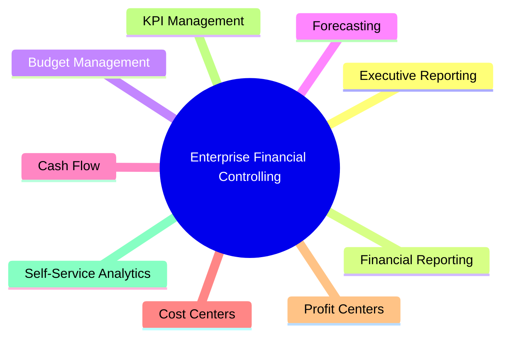
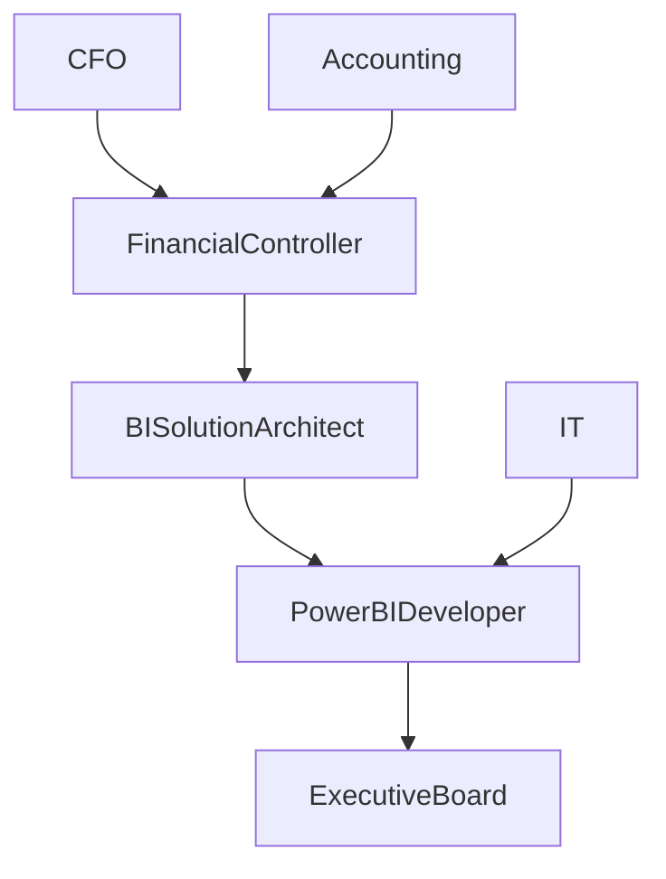
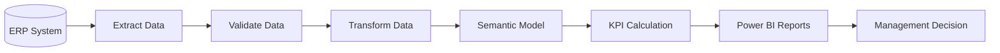
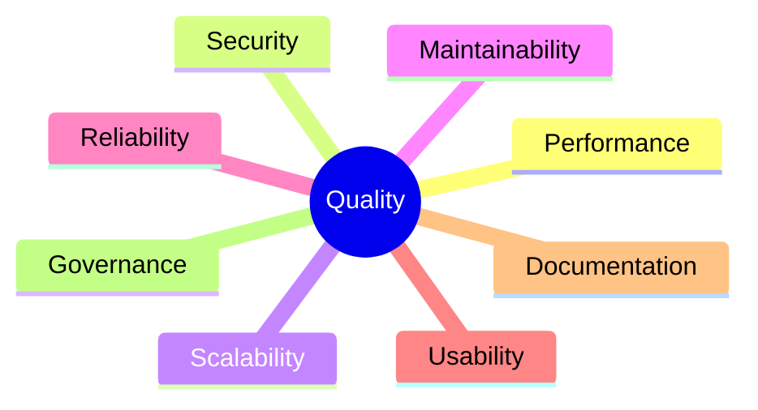
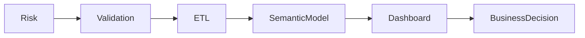
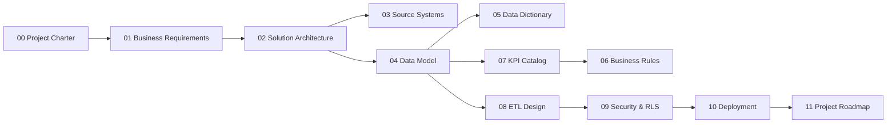

# Business Requirements Document (BRD)

> **Project:** Enterprise Financial Analytics Platform (EFAP) 
> **Document ID:** SD-01  
> **Version:** 1.0  
> **Status:** Draft  
> **Author:** *Ondřej Seidl*  
> **Last Updated:** July 2026

---

# Document Control

| Field | Value |
|-------|-------|
| Document Name | Business Requirements Document |
| Document ID | SD-01 |
| Version | 1.0 |
| Status | Draft |
| Owner | BI Solution Architect |
| Reviewers | Financial Controller, Product Owner |
| Classification | Internal |

---

# Revision History

| Version | Date | Author | Description |
|----------|------|--------|-------------|
| 1.0 | July 2026 | Your Name | Initial version |

---

# Table of Contents

1. Executive Summary
2. Business Context
3. Business Vision
4. Business Objectives
5. Business Capabilities
6. Stakeholders
7. Scope
8. Functional Requirements
9. Non-Functional Requirements
10. Success Criteria
11. Related Documents

---

# 1. Executive Summary

The **Enterprise Financial Analytics Platform (EFAP)** is designed to replace fragmented spreadsheet-based financial reporting with a centralized Business Intelligence platform.

The solution will provide management with accurate, timely, and interactive financial information, enabling faster and more informed decision-making.

The platform is designed according to enterprise BI principles and simulates a real-world implementation within a mid-sized manufacturing company.

---

# 2. Business Context

## Current Situation

The finance department currently relies on multiple disconnected reporting processes:

- Excel workbooks
- Manual consolidations
- Department-specific reports
- Static monthly presentations
- Manual variance calculations

These processes create several business challenges:

- inconsistent reporting
- duplicated calculations
- slow reporting cycles
- high risk of human error
- limited transparency
- poor scalability

---

## Business Drivers

The project is initiated to address the following strategic needs:

- Improve financial transparency
- Reduce manual effort
- Increase reporting consistency
- Enable self-service analytics
- Standardize KPI definitions
- Improve executive decision-making
- Build a scalable reporting platform

---

# 3. Business Vision

Create a single, trusted analytical platform that delivers reliable financial information across the organization while supporting operational, tactical, and strategic decision-making.

The platform should become the **Single Source of Truth (SSOT)** for management reporting.

---

# 4. Business Objectives

The project will achieve the following objectives:

| Objective | Priority |
|------------|-----------|
| Automate financial reporting | High |
| Reduce manual reporting | High |
| Improve reporting accuracy | High |
| Budget vs Actual analysis | High |
| Forecast reporting | High |
| Cost center analysis | High |
| Profit center analysis | High |
| Executive dashboards | High |
| Financial KPI standardization | High |
| Self-service reporting | Medium |

---

# Business Vision Diagram

---
# 5. Business Capabilities

The platform will provide the following business capabilities:

| Capability | Description | Priority |
|------------|-------------|----------|
| Financial Reporting | Standardized monthly financial statements and management reports | High |
| Budget Control | Budget planning, tracking and variance analysis | High |
| Forecasting | Rolling forecast and year-end outlook | High |
| Cost Center Analysis | Expense monitoring by organizational unit | High |
| Profit Center Analysis | Profitability analysis by business area | High |
| Cash Flow Monitoring | Analysis of operating, investing and financing cash flows | High |
| KPI Management | Centralized financial KPI definitions and monitoring | High |
| Executive Dashboards | Interactive dashboards for senior management | High |
| Self-Service Analytics | Flexible ad-hoc analysis for business users | Medium |

---

# 6. Stakeholders

| Stakeholder | Role | Responsibilities |
|-------------|------|------------------|
| Executive Board | Strategic Decision Maker | Reviews company performance and strategic KPIs |
| Chief Financial Officer (CFO) | Business Sponsor | Owns financial reporting and project direction |
| Financial Controller | Business Owner | Defines reporting requirements and validates outputs |
| Accounting Department | Data Provider | Maintains accounting records and source transactions |
| BI Solution Architect | Solution Owner | Designs overall BI architecture |
| Power BI Developer | Technical Implementation | Develops semantic model, DAX and reports |
| IT Department | Infrastructure Support | Maintains systems and security |
| Department Managers | Business Users | Consume operational and financial reports |

---

# Stakeholder Relationship

---

# 7. High-Level Business Process

The financial reporting process follows a monthly reporting cycle.

1. Financial transactions are recorded in the ERP system.
2. Data is extracted into the reporting environment.
3. Data quality checks and business validations are performed.
4. Financial data is transformed into an analytical model.
5. KPIs are calculated using standardized business rules.
6. Interactive dashboards are published for business users.
7. Management reviews results and initiates corrective actions where required.

---

# Financial Reporting Process

---

# 8. Project Scope

The project includes the design, implementation and documentation of a complete enterprise financial reporting solution.

## Included

- General Ledger reporting
- Profit & Loss Statement
- Budget vs Actual reporting
- Forecast reporting
- Cash Flow reporting
- Cost Center reporting
- Profit Center reporting
- Executive dashboard
- KPI catalog
- Star schema data model
- Power Query ETL
- DAX measure library
- Data dictionary
- Business rules documentation
- Security model (RLS)

---

## Out of Scope

The following areas are intentionally excluded from the initial implementation:

- Payroll processing
- Tax reporting
- Manufacturing execution systems (MES)
- Customer relationship management (CRM)
- Supply chain optimization
- Inventory optimization
- Predictive AI models
- Real-time streaming analytics

---

# 9. Functional Requirements

The solution shall provide the following functional capabilities.

| ID | Requirement | Priority |
|----|-------------|----------|
| FR-001 | Import financial data from the ERP system. | High |
| FR-002 | Import budget data from Microsoft Excel files. | High |
| FR-003 | Support monthly forecast uploads. | High |
| FR-004 | Store data using a Star Schema model. | High |
| FR-005 | Calculate standardized financial KPIs. | High |
| FR-006 | Provide Budget vs Actual analysis. | High |
| FR-007 | Support Month-to-Date (MTD) and Year-to-Date (YTD) reporting. | High |
| FR-008 | Enable drill-down from executive summary to transaction level. | High |
| FR-009 | Filter reports by Company, Business Unit, Cost Center, Profit Center and Fiscal Period. | High |
| FR-010 | Provide interactive dashboards for executive management. | High |
| FR-011 | Support Row-Level Security (RLS). | Medium |
| FR-012 | Export report data to Excel and PDF. | Medium |
| FR-013 | Provide automated monthly refresh process. | High |
| FR-014 | Maintain a centralized KPI catalog. | High |
| FR-015 | Ensure consistent business rules across all reports. | High |

---

# 10. Non-Functional Requirements

| ID | Requirement | Target |
|----|-------------|--------|
| NFR-001 | Report opening time | < 5 seconds |
| NFR-002 | Visual interaction response | < 2 seconds |
| NFR-003 | Scheduled refresh duration | < 30 minutes |
| NFR-004 | Availability | 99% |
| NFR-005 | Security | Role-based access using RLS |
| NFR-006 | Maintainability | Modular Power Query and DAX design |
| NFR-007 | Scalability | Support future business entities and KPIs |
| NFR-008 | Documentation | Complete project documentation in Markdown |
| NFR-009 | Naming Standards | Enterprise naming conventions |
| NFR-010 | Data Quality | Validation rules before model refresh |

---

# Quality Attributes

---

# 11. Business Assumptions

The project is based on the following assumptions:

- Financial data is available on a monthly basis.
- The ERP system provides complete General Ledger data.
- Budget and Forecast data are maintained by the Finance department.
- Financial reporting follows a monthly closing cycle.
- All KPIs use standardized business definitions.
- Historical data is available for trend analysis.
- Source data is considered accurate after validation.

---

# 12. Project Constraints

The following constraints apply to this implementation:

- Sample data will be used instead of production data.
- ERP connectivity is simulated.
- Development is limited to Microsoft Power BI ecosystem.
- No real-time reporting is included.
- Cloud services are optional and outside the initial scope.

---

# 13. Business Risks

| Risk | Impact | Mitigation |
|------|--------|------------|
| Poor data quality | High | Data validation during ETL |
| Scope expansion | High | Formal change management |
| Inconsistent KPI definitions | High | Central KPI Catalog |
| Performance degradation | Medium | Star Schema and DAX optimization |
| Incorrect business rules | High | Validation with Financial Controller |
| Manual source files | Medium | Standardized templates and validation |

---

# Risk Overview

---

# 14. Success Criteria

The project will be considered successful when the following criteria are met.

## Business Success

- Monthly financial reporting is fully standardized.
- Budget vs Actual reporting is available for all business units.
- Financial KPIs are calculated consistently across all reports.
- Executive management has access to interactive dashboards.
- Manual reporting effort is significantly reduced.

## Technical Success

- Enterprise Star Schema is implemented.
- Power Query follows modular ETL design.
- DAX measures follow project standards.
- Report performance meets defined targets.
- Documentation is complete and maintained.

---

# 15. Business Glossary

| Term | Definition |
|------|------------|
| ERP | Enterprise Resource Planning system used as the primary financial data source. |
| General Ledger (GL) | Central repository of all accounting transactions. |
| Cost Center | Organizational unit responsible for operational costs. |
| Profit Center | Organizational unit responsible for revenue and profitability. |
| Budget | Planned financial values for a reporting period. |
| Forecast | Updated estimate of future financial performance. |
| Actuals | Financial results recorded in the ERP system. |
| Variance | Difference between Actual and Budget or Forecast values. |
| Semantic Model | Business-ready analytical model used by Power BI. |
| KPI | Key Performance Indicator used to measure business performance. |

---

# 16. Requirement Traceability Matrix

| Requirement | Related Document |
|------------|------------------|
| FR-001 | 03_Source_Systems.md |
| FR-004 | 04_Data_Model.md |
| FR-005 | 07_KPI_Catalog.md |
| FR-006 | 07_KPI_Catalog.md |
| FR-011 | 09_Security_RLS.md |
| FR-013 | 08_ETL_Design.md |
| NFR-001 | ADR-Performance-Optimization |
| NFR-005 | 09_Security_RLS.md |
| NFR-006 | ADR-DAX-Standards |
| NFR-010 | 08_ETL_Design.md |

---

# 17. Document Dependencies

---

# 18. Related Documents

This Business Requirements Document is supported by the following project documentation:

- 00_Project_Charter.md
- 02_Solution_Architecture.md
- 03_Source_Systems.md
- 04_Data_Model.md
- 05_Data_Dictionary.md
- 06_Business_Rules.md
- 07_KPI_Catalog.md
- 08_ETL_Design.md
- 09_Security_RLS.md
- 10_Deployment.md
- 11_Project_Roadmap.md

---

# 19. Approval

| Role | Status |
|------|--------|
| Executive Sponsor | Pending |
| Chief Financial Officer | Pending |
| Financial Controller | Approved |
| BI Solution Architect | Approved |
| Product Owner | Approved |

---

**End of Document**