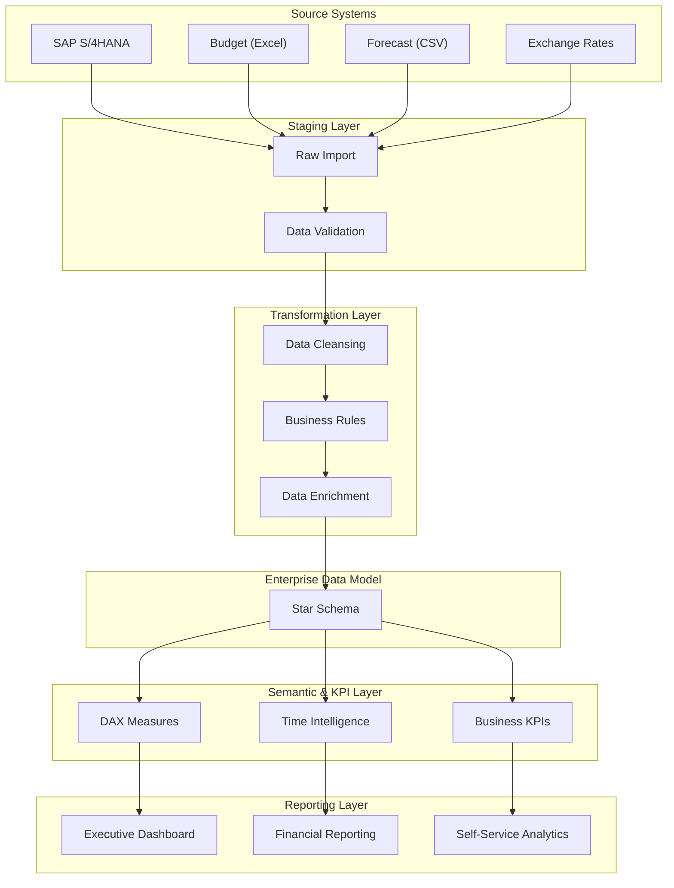

# Solution Architecture

> **Project:** Enterprise Financial Analytics Platform (EFAP)  
> **Document ID:** SD-02  
> **Version:** 1.0  
> **Status:** Approved  
> **Author:** *Ondřej Seidl*  
> **Last Updated:** July 2026

---

# Document Control

| Field | Value |
|-------|-------|
| Document Name | Solution Architecture |
| Document ID | SD-02 |
| Version | 1.0 |
| Status | Approved |
| Owner | BI Solution Architect |
| Reviewers | Financial Controller, Product Owner |
| Classification | Internal |

---

# Revision History

| Version | Date | Author | Description |
|----------|------|--------|-------------|
| 1.0 | July 2026 | Your Name | Initial release |

---

# Table of Contents

1. Executive Overview
2. Architecture Goals
3. Architecture Principles
4. High-Level Solution Architecture
5. Related Documents

---

# 1. Executive Overview

The **Enterprise Financial Analytics Platform (EFAP)** is designed as a layered Business Intelligence solution that transforms financial data into trusted analytical information for executive decision-making.

The architecture separates data ingestion, transformation, semantic modeling, KPI calculation, and reporting into independent layers. This approach improves maintainability, scalability, data quality, and long-term extensibility.

The solution follows modern Business Intelligence design principles and provides a foundation for future migration to enterprise data platforms such as Microsoft Fabric or Azure-based analytics services.

---

# 2. Architecture Goals

The architecture has been designed to achieve the following objectives:

| Goal | Description |
|------|-------------|
| Scalability | Support future business growth and additional data sources. |
| Maintainability | Separate responsibilities across logical layers. |
| Performance | Optimize analytical queries and report responsiveness. |
| Data Quality | Validate and standardize data before reporting. |
| Security | Protect sensitive financial information using role-based access. |
| Reusability | Reuse business logic and KPI definitions across reports. |
| Governance | Establish a consistent reporting and documentation framework. |

---

# 3. Architecture Principles

The solution is based on the following architectural principles:

1. **Layered Architecture** – Separate ingestion, transformation, modeling and reporting responsibilities.
2. **Single Source of Truth (SSOT)** – Financial data is modeled once and reused everywhere.
3. **Business Before Technology** – Business requirements drive technical implementation.
4. **Star Schema Modeling** – Analytical data is optimized for reporting performance.
5. **Reusable Business Logic** – KPI calculations are centralized in the semantic model.
6. **Documentation First** – All implementation artifacts are supported by project documentation.
7. **Security by Design** – Security is considered throughout the solution lifecycle.

> **Architecture Decision Reference:** ADR-001 – Layered Architecture

---

# Figure 2.1 – High-Level Solution Architecture

**Figure 2.1 Description**

This diagram illustrates the logical architecture of the Enterprise Financial Analytics Platform. Financial data flows through clearly separated layers, from operational source systems to executive reporting. Each layer has a defined responsibility, reducing coupling and improving maintainability.

---

# 4. Related Documents

| Document | Purpose |
|----------|---------|
| 00_Project_Charter.md | Project objectives and governance |
| 01_Business_Requirements.md | Business requirements and scope |
| ADR-001-Layered-Architecture.md | Architectural decision for layered design |
| 03_Source_Systems.md | Source system definitions |
| 04_Data_Model.md | Enterprise Star Schema |