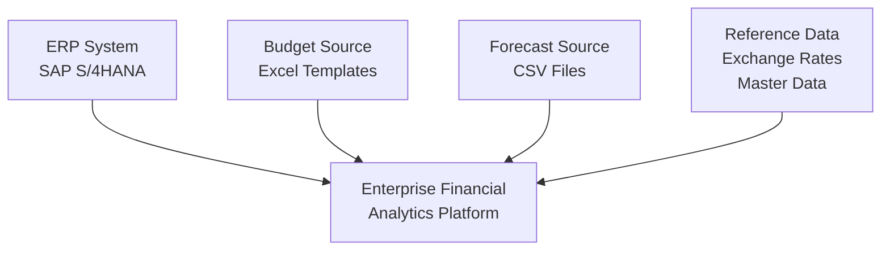

# Source Systems

> **Project:** Enterprise Financial Analytics Platform (EFAP)  
> **Document ID:** SD-03  
> **Version:** 1.0  
> **Status:** Draft  
> **Owner:** BI Solution Architect  
> **Last Updated:** July 2026

---

# Document Control

| Field | Value |
|------|-------|
| Document Name | Source Systems |
| Document ID | SD-03 |
| Version | 1.0 |
| Status | Draft |
| Owner | BI Solution Architect |
| Classification | Internal |

---

# Revision History

| Version | Date | Author | Description |
|---------|------|--------|-------------|
| 1.0 | July 2026 | Ondřej Seidl | Initial version |

---

# Table of Contents

1. Purpose  
2. Source System Landscape  
3. ERP System  
4. Budget Data Source  
5. Forecast Data Source  
6. Reference Data Sources  
7. Source Data Flow  
8. Data Quality Considerations  
9. Source System Risks  
10. Related Documents  

---

# 1. Purpose

This document describes the source systems that provide financial and organizational data for the **Enterprise Financial Analytics Platform (EFAP)**.

The purpose of this document is to define:

- source system responsibilities,
- data ownership,
- extracted business objects,
- refresh frequency,
- integration approach,
- data quality expectations.

The defined source landscape provides the foundation for the ETL process, enterprise data model, and analytical reporting layer.

---

# 2. Source System Landscape

The solution combines multiple financial data sources to provide a complete view of actuals, budgets, forecasts, and reference information.

---

# Source System Overview

| Source | Purpose | Data Type | Refresh |
|--------|---------|-----------|---------|
| ERP System | Actual financial transactions | Structured data | Daily |
| Budget Files | Annual budget planning | Excel | Monthly |
| Forecast Files | Rolling forecast | CSV | Monthly |
| Reference Data | Supporting master data | Excel/API | Daily |

---

# 3. ERP System

## 3.1 Overview

The primary source system for actual financial data is an ERP platform represented by:

**SAP S/4HANA**

The ERP system provides transactional and master data required for financial reporting and controlling processes.

The ERP system is considered the authoritative source for actual financial postings.

---

## 3.2 Financial Data Objects

The following business objects are extracted from the ERP system:

| Object | Description |
|--------|-------------|
| General Ledger Transactions | Actual accounting postings |
| Chart of Accounts | Financial account structure |
| Company Codes | Legal entities |
| Cost Centers | Responsibility areas |
| Profit Centers | Profitability structures |
| Vendors | Supplier master data |
| Customers | Customer master data |

---

## 3.3 Extraction Approach

The extraction process follows these principles:

- Incremental data extraction where possible.
- Only required fields are transferred.
- Source data remains unchanged.
- Transformations are performed outside the source system.

The ERP system is not modified by the analytical solution.

---

# 4. Budget Data Source

## 4.1 Overview

Budget information is provided through standardized Microsoft Excel templates maintained by finance teams.

The budget source supports planning and comparison between:

- Actual results,
- Approved budget,
- Variance analysis.

---

## 4.2 Budget Data Structure

| Field | Description |
|------|-------------|
| Fiscal Year | Reporting year |
| Period | Month |
| Company | Organizational entity |
| Cost Center | Responsibility area |
| Account | Financial account |
| Budget Amount | Planned value |

---

## 4.3 Validation Rules

Before loading budget data:

- Mandatory fields must be completed.
- Account mapping must exist.
- Period format must be valid.
- Numeric values must be positive where applicable.
- Duplicate records must be detected.

---

# 5. Forecast Data Source

## 5.1 Overview

Forecast information is provided through controlled CSV uploads.

The forecast process supports rolling financial projections and management decision-making.

---

## 5.2 Forecast Data Structure

| Field | Description |
|------|-------------|
| Forecast Version | Forecast scenario |
| Fiscal Year | Reporting year |
| Period | Month |
| Company | Organizational entity |
| Cost Center | Responsibility area |
| Account | Financial account |
| Forecast Amount | Expected value |

---

# 6. Reference Data Sources

Reference data provides additional information required for consistent reporting.

---

## 6.1 Exchange Rates

Exchange rates are used for:

- currency conversion,
- group reporting,
- consolidated analysis.

---

## 6.2 Master Data

Reference data includes:

| Dataset | Purpose |
|---------|---------|
| Calendar | Time intelligence |
| Account Mapping | Financial hierarchy |
| Organization Structure | Company hierarchy |
| Currency Table | Conversion rules |

---

# 7. Source Data Flow

The source data follows the enterprise architecture pipeline:

---

# 8. Data Quality Considerations

Data quality controls are applied during ingestion and transformation.

| Area | Control |
|------|---------|
| Completeness | Required fields validation |
| Accuracy | Source reconciliation |
| Consistency | Standardized mappings |
| Timeliness | Refresh monitoring |
| Uniqueness | Duplicate detection |

---

# 9. Source System Risks

| Risk | Impact | Mitigation |
|------|--------|------------|
| Missing source data | Incorrect reporting | Validation checks |
| Changed file structure | ETL failure | Template governance |
| Incorrect master data | KPI errors | Mapping validation |
| Late submissions | Delayed reporting | Monitoring process |

---

# 10. Related Documents

| Document | Purpose |
|----------|---------|
| 00_Project_Charter.md | Project objectives |
| 01_Business_Requirements.md | Business needs |
| 02_Solution_Architecture.md | Overall solution design |
| ADR/ADR-001-Layered-Architecture.md | Architecture decision |
| 04_Data_Model.md | Enterprise data model |
| 08_ETL_Design.md | Data transformation design |

---

# End of Document