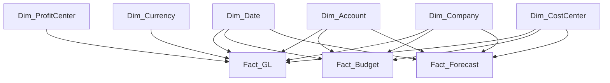

# Data Model

> **Project:** Enterprise Financial Analytics Platform (EFAP)  
> **Document ID:** SD-04  
> **Version:** 1.0  
> **Status:** Draft  
> **Owner:** BI Solution Architect  
> **Last Updated:** July 2026

---

# Navigation

⬅️ Previous: [Source Systems](03_Source_Systems.md)

➡️ Next: [Data Dictionary](05_Data_Dictionary.md)

---

# Document Control

| Field | Value |
|------|-------|
| Document Name | Data Model |
| Document ID | SD-04 |
| Version | 1.0 |
| Status | Draft |
| Owner | BI Solution Architect |
| Classification | Internal |

---

# Revision History

| Version | Date | Author | Description |
|---------|------|--------|-------------|
| 1.0 | July 2026 | Ondřej Seidl | Initial version |

---

# Table of Contents

1. Purpose  
2. Data Modeling Principles  
3. Enterprise Data Model Overview  
4. Star Schema Architecture  
5. Fact Tables  
6. Dimension Tables  
7. Relationships  
8. Semantic Model Design  
9. Naming Conventions  
10. Performance Considerations  
11. Related Documents  

---

# 1. Purpose

This document defines the analytical data model for the **Enterprise Financial Analytics Platform (EFAP)**.

The purpose of the model is to provide a consistent and scalable foundation for:

- financial reporting,
- budget analysis,
- forecasting,
- management dashboards,
- KPI calculations.

The model follows dimensional modeling principles and is optimized for analytical workloads.

---

# 2. Data Modeling Principles

The data model follows the following principles:

| Principle | Description |
|-----------|-------------|
| Star Schema | Analytical model based on facts and dimensions |
| Single Source of Truth | Centralized business data model |
| Reusability | Shared dimensions across processes |
| Performance | Optimized analytical relationships |
| Simplicity | Clear and understandable structure |
| Governance | Controlled naming and definitions |

Architecture decision:

- [ADR-002 - Star Schema](ADR/ADR-002-Star-Schema.md)

---

# 3. Enterprise Data Model Overview

The EFAP analytical model combines three financial processes:

| Process | Description |
|---------|-------------|
| Actuals | Posted financial transactions |
| Budget | Planned financial values |
| Forecast | Expected future values |

---

# 4. Star Schema Architecture

The model uses a dimensional architecture consisting of:

- Fact tables containing measurable values.
- Dimension tables containing descriptive business attributes.

---

# Figure 4.1 – Enterprise Financial Star Schema



**Figure 4.1 Description**

The star schema provides a centralized analytical model where multiple financial processes share common dimensions.

---

# 5. Fact Tables

## 5.1 Fact_GL

### Purpose

Stores actual financial transactions received from the ERP system.

### Grain

One record represents one financial posting.

### Attributes

| Column | Description |
|--------|-------------|
| GL_ID | Transaction identifier |
| Date_Key | Transaction date |
| Company_Key | Company reference |
| Account_Key | Account reference |
| CostCenter_Key | Cost center reference |
| ProfitCenter_Key | Profit center reference |
| Currency_Key | Currency reference |
| Amount | Financial value |

---

## 5.2 Fact_Budget

### Purpose

Stores approved budget values.

### Grain

One record represents one budget value by financial period and organizational dimension.

### Attributes

| Column | Description |
|--------|-------------|
| Budget_ID | Record identifier |
| Date_Key | Budget period |
| Company_Key | Company reference |
| Account_Key | Account reference |
| CostCenter_Key | Cost center reference |
| Budget_Amount | Planned value |

---

## 5.3 Fact_Forecast

### Purpose

Stores forecast scenarios.

### Grain

One record represents one forecast value by period and business dimension.

### Attributes

| Column | Description |
|--------|-------------|
| Forecast_ID | Record identifier |
| Date_Key | Forecast period |
| Company_Key | Company reference |
| Account_Key | Account reference |
| CostCenter_Key | Cost center reference |
| Forecast_Amount | Forecast value |

---

# 6. Dimension Tables

## 6.1 Dim_Date

Central time dimension used across all financial processes.

| Attribute | Description |
|-----------|-------------|
| Date_Key | Surrogate key |
| Date | Calendar date |
| Year | Calendar year |
| Quarter | Calendar quarter |
| Month | Month |
| Fiscal Year | Financial year |
| Fiscal Period | Financial period |

---

## 6.2 Dim_Account

Financial account hierarchy.

Hierarchy:

```text
Account Group
        |
        ▼
Account Category
        |
        ▼
Account
```

---

## 6.3 Dim_Company

Company master data.

Attributes:

- Company Code
- Company Name
- Country
- Region

---

## 6.4 Dim_CostCenter

Cost center structure.

Attributes:

- Cost Center ID
- Cost Center Name
- Department
- Owner

---

## 6.5 Dim_ProfitCenter

Profitability structure.

Attributes:

- Profit Center ID
- Business Unit
- Segment

---

## 6.6 Dim_Currency

Currency reference data.

Attributes:

- Currency Code
- Currency Name
- Exchange Rate Type

---

# 7. Relationships

The model follows controlled relationship principles.

Rules:

- Dimension to Fact relationships are one-to-many.
- Filtering direction is single direction.
- Many-to-many relationships are avoided.

Example:

```text
Dim_Date
    |
    |
    ▼
Fact_GL
```

---

# 8. Semantic Model Design

The semantic model contains:

- reusable DAX measures,
- KPI definitions,
- time intelligence calculations,
- business calculations.

Examples:

- Revenue
- Gross Profit
- EBITDA
- Budget Variance
- Forecast Accuracy

---

# 9. Naming Conventions

## Tables

| Type | Convention |
|------|------------|
| Fact | Fact_Name |
| Dimension | Dim_Name |

Examples:

- Fact_GL
- Dim_Date

---

## Keys

Surrogate keys use:

```text
<Table>_Key
```

Example:

```text
Account_Key
Company_Key
```

---

# 10. Performance Considerations

The model is optimized through:

- star schema design,
- reduced relationship complexity,
- reusable dimensions,
- minimized calculated columns,
- centralized measures.

---

# 11. Related Documents

- [Solution Architecture](02_Solution_Architecture.md)
- [Source Systems](03_Source_Systems.md)
- [Data Dictionary](05_Data_Dictionary.md)
- [Business Rules](06_Business_Rules.md)
- [KPI Catalog](07_KPI_Catalog.md)
- [ETL Design](08_ETL_Design.md)

Related ADRs:

- [ADR-001 - Layered Architecture](ADR/ADR-001-Layered-Architecture.md)
- [ADR-002 - Star Schema](ADR/ADR-002-Star-Schema.md)

---

# End of Document