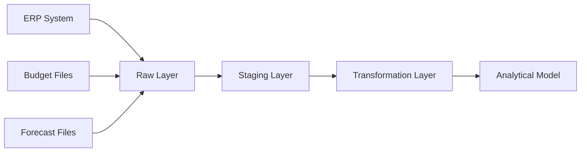

# ETL Design

> **Project:** Enterprise Financial Analytics Platform (EFAP)  
> **Document ID:** SD-08  
> **Version:** 1.0  
> **Status:** Draft  
> **Owner:** BI Solution Architect  
> **Last Updated:** July 2026

---

# Navigation

⬅️ Previous: [KPI Catalog](07_KPI_Catalog.md)

➡️ Next: [Security and RLS](09_Security_RLS.md)

---

# Document Control

| Field | Value |
|------|-------|
| Document Name | ETL Design |
| Document ID | SD-08 |
| Version | 1.0 |
| Status | Draft |
| Owner | BI Solution Architect |
| Classification | Internal |

---

# Revision History

| Version | Date | Author | Description |
|---------|------|--------|-------------|
| 1.0 | July 2026 | Your Name | Initial version |

---

# 1. Purpose

This document defines the Extract, Transform, Load (ETL) architecture for the Enterprise Financial Analytics Platform (EFAP).

The purpose is to describe:

- data ingestion,
- transformation processes,
- data validation,
- loading strategy,
- refresh management.

---

# 2. ETL Architecture Overview

The ETL process follows a layered data architecture.



**Figure 2.1 Description**

The ETL process separates ingestion, preparation, transformation, and analytical consumption.

---

# 3. Data Processing Layers

---

# 3.1 Raw Layer

## Purpose

The Raw Layer stores original source data without business modification.

Characteristics:

- immutable source copy,
- audit capability,
- original structure preserved.

Examples:

```text
ERP_GL_YYYYMMDD
Budget_Input_YYYYMM
Forecast_Input_YYYYMM
```

---

# 3.2 Staging Layer

## Purpose

The Staging Layer prepares data for transformation.

Activities:

- data type conversion,
- duplicate detection,
- null checks,
- technical validation.

Examples:

```text
stg_GL

stg_Budget

stg_Forecast
```

---

# 3.3 Transformation Layer

## Purpose

The Transformation Layer applies business logic.

Activities:

- account mapping,
- dimension lookups,
- surrogate key creation,
- business classification.

Examples:

```text
Account Code

        |

        ▼

Dim_Account Mapping
```

---

# 3.4 Semantic Layer

## Purpose

Provides analytical model for reporting.

Contains:

- Fact tables,
- Dimension tables,
- Measures,
- KPI calculations.

Output:

```text
Fact_GL

Fact_Budget

Fact_Forecast

+

Dimensions

+

DAX Measures
```

---

# 4. Dimension Loading

## 4.1 Dim_Date

Loading rules:

- Generated internally.
- Covers required reporting periods.
- Supports fiscal calendar.

---

## 4.2 Dim_Account

Loading rules:

- Source account list imported.
- Mapping rules applied.
- Account hierarchy maintained.

Validation:

```text
Every Fact_GL record must have valid Account_Key
```

---

## 4.3 Dim_Company

Loading rules:

- Company master data loaded.
- Unique company identifier required.

---

## 4.4 Dim_CostCenter

Loading rules:

- Cost center hierarchy maintained.
- Invalid references rejected.

---

# 5. Fact Loading

---

# 5.1 Fact_GL

## Source

ERP financial transactions.

## Process

```text
Extract

↓

Validate

↓

Map Dimensions

↓

Load Fact_GL
```

Validation:

- valid account,
- valid company,
- valid date,
- amount not null.

---

# 5.2 Fact_Budget

## Source

Finance budget files.

Process:

```text
Import File

↓

Validate Structure

↓

Apply Mapping

↓

Load Fact_Budget
```

---

# 5.3 Fact_Forecast

## Source

Forecast input files.

Process:

```text
Import Forecast

↓

Validate Version

↓

Apply Mapping

↓

Load Fact_Forecast
```

---

# 6. Data Quality Rules

| Rule | Description |
|-|-|
| Account Validation | Every transaction requires valid account |
| Date Validation | Transaction date must exist |
| Amount Validation | Amount cannot be empty |
| Duplicate Check | Duplicate transactions detected |
| Dimension Integrity | All keys must exist |

---

# 7. Error Handling

Errors are classified as:

| Type | Action |
|-|-|
| Missing Dimension | Reject or default mapping |
| Invalid Amount | Reject record |
| Missing Date | Send to exception queue |
| Duplicate Record | Log and investigate |

---

# 8. Refresh Strategy

| Dataset | Frequency |
|-|-|
| Actual Financial Data | Daily |
| Budget Data | On Change |
| Forecast Data | Monthly |
| Master Data | Daily |

---

# 9. Performance Optimization

Optimization principles:

- Incremental loading where possible.
- Avoid unnecessary transformations.
- Reduce data duplication.
- Use surrogate keys.
- Separate historical and current data.

---

# 10. Related Documents

- [Source Systems](03_Source_Systems.md)
- [Data Model](04_Data_Model.md)
- [Data Dictionary](05_Data_Dictionary.md)
- [Business Rules](06_Business_Rules.md)
- [KPI Catalog](07_KPI_Catalog.md)
- [Security and RLS](09_Security_RLS.md)

Related ADRs:

- [ADR-001 - Layered Architecture](ADR/ADR-001-Layered-Architecture.md)
- [ADR-002 - Star Schema](ADR/ADR-002-Star-Schema.md)

---

# End of Document