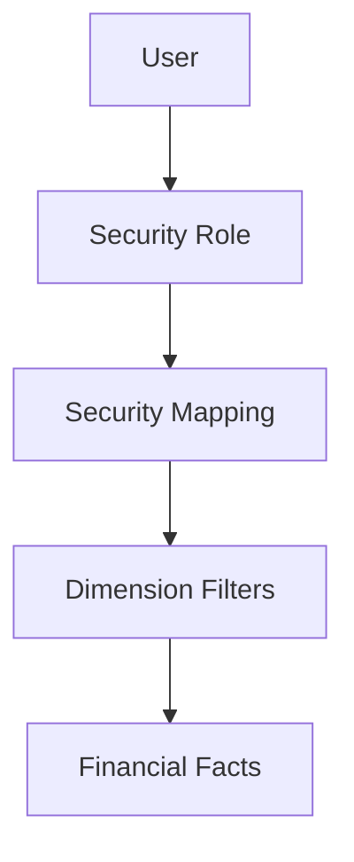

# Security and RLS

> **Project:** Enterprise Financial Analytics Platform (EFAP)  
> **Document ID:** SD-09  
> **Version:** 1.0  
> **Status:** Draft  
> **Owner:** BI Solution Architect  
> **Last Updated:** July 2026

---

# Navigation

⬅️ Previous: [ETL Design](08_ETL_Design.md)

➡️ Next: [Deployment](10_Deployment.md)

---

# Document Control

| Field | Value |
|-|-|
| Document Name | Security and RLS |
| Document ID | SD-09 |
| Version | 1.0 |
| Status | Draft |
| Owner | BI Solution Architect |
| Classification | Internal |

---

# Revision History

| Version | Date | Author | Description |
|-|-|-|-|
| 1.0 | July 2026 | Your Name | Initial version |

---

# 1. Purpose

This document defines the security architecture and Row Level Security (RLS) model for EFAP.

The objective is to ensure:

- controlled financial data access,
- separation of organizational responsibilities,
- auditability,
- scalable permission management.

---

# 2. Security Principles

The solution follows these principles:

| Principle | Description |
|-|-|
| Least Privilege | Users receive only required access |
| Dynamic Security | Permissions controlled by data |
| Auditability | Access rules are traceable |
| Scalability | New users and companies require minimal changes |

---

# 3. Security Architecture

The security model follows dynamic filtering:



**Figure 3.1 Description**

User identity determines allowed organizational scope through security mapping tables.

---

# 4. User Roles

## 4.1 Executive Management

Access:

- All companies
- All regions
- Aggregated financial view

Usage:

- Executive dashboards
- Strategic reporting

---

## 4.2 Finance Management

Access:

- Financial data across assigned entities
- Budget and forecast information

Usage:

- Controlling
- Planning
- Performance monitoring

---

## 4.3 Controller

Access:

- Assigned companies
- Assigned cost centers
- Transaction-level details

Usage:

- Variance analysis
- Cost control

---

## 4.4 Department Manager

Access:

- Own department
- Assigned cost centers

Usage:

- Department performance

---

## 4.5 Analyst

Access:

- According to assigned permissions

Usage:

- Reporting
- Data analysis

---

# 5. Row Level Security Design

## 5.1 Dynamic Filtering Principle

Security filtering is based on:

```text
User Email

↓

Security Mapping Table

↓

Allowed Dimensions

↓

Fact Tables
```

---

# 5.2 Company Filtering

Users can access only companies assigned to them.

Example:

```text
User A

Allowed:

Company 001
Company 002
```

---

# 5.3 Cost Center Filtering

Users can be restricted to specific cost centers.

Example:

```text
Controller Finance

Allowed:

Cost Center 100
Cost Center 200
```

---

# 5.4 Region Filtering

Regional management can access data by geographical scope.

Example:

```text
Region Manager

Allowed:

Europe Region
```

---

# 6. Security Mapping Model

The main security table:

## Security_UserAccess

| Column | Description |
|-|-|
| User_Email | User identity |
| Role | Security role |
| Company_Key | Allowed company |
| CostCenter_Key | Allowed cost center |
| Region | Allowed region |

---

# 7. Data Access Rules

Rules:

| Rule | Description |
|-|-|
| Default Deny | No access without assignment |
| Explicit Permission | Access requires mapping |
| No Manual Filtering | Security handled centrally |
| Audit Required | Changes must be traceable |

---

# 8. Audit and Monitoring

Security administration should track:

- user changes,
- role changes,
- permission changes,
- access reviews.

Recommended review:

```text
Quarterly Access Review
```

---

# 9. Architecture Decision

Dynamic RLS is approved through:

[ADR-003 - Dynamic Row Level Security Model](ADR/ADR-003-Dynamic-RLS.md)

---

# 10. Related Documents

- [Data Model](04_Data_Model.md)
- [Data Dictionary](05_Data_Dictionary.md)
- [Business Rules](06_Business_Rules.md)
- [KPI Catalog](07_KPI_Catalog.md)
- [ETL Design](08_ETL_Design.md)

Related ADRs:

- [ADR-001 - Layered Architecture](ADR/ADR-001-Layered-Architecture.md)
- [ADR-002 - Star Schema](ADR/ADR-002-Star-Schema.md)
- [ADR-003 - Dynamic Row Level Security Model](ADR/ADR-003-Dynamic-RLS.md)

---

# End of Document