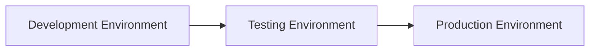

# Deployment Architecture

> **Project:** Enterprise Financial Analytics Platform (EFAP)  
> **Document ID:** SD-10  
> **Version:** 1.0  
> **Status:** Draft  
> **Owner:** BI Solution Architect  
> **Last Updated:** July 2026

---

# Navigation

⬅️ Previous: [Security and RLS](09_Security_RLS.md)

➡️ Next: [Project Roadmap](11_Project_Roadmap.md)

---

# Document Control

| Field | Value |
|-|-|
| Document Name | Deployment Architecture |
| Document ID | SD-10 |
| Version | 1.0 |
| Status | Draft |
| Owner | BI Solution Architect |
| Classification | Internal |

---

# Revision History

| Version | Date | Author | Description |
|-|-|-|-|
| 1.0 | July 2026 | Ondřej Seidl | Initial version |

---

# 1. Purpose

This document defines the deployment architecture and operational model of EFAP.

The objective is to provide:

- controlled releases,
- environment separation,
- version management,
- reliable operation.

---

# 2. Deployment Principles

The solution follows these principles:

| Principle | Description |
|-|-|
| Separation of Environments | Development, Testing, Production separated |
| Controlled Release | Changes promoted through stages |
| Version Control | All changes tracked |
| Repeatability | Deployment process documented |

---

# 3. Environment Architecture



---

# 4. Development Environment

Purpose:

- development,
- experimentation,
- unit testing.

Contains:

- development datasets,
- draft reports,
- new measures.

---

# 5. Testing Environment

Purpose:

- validation,
- user acceptance testing,
- performance checks.

Activities:

- business validation,
- KPI verification,
- security testing.

---

# 6. Production Environment

Purpose:

Official reporting environment.

Contains:

- approved semantic models,
- production dashboards,
- controlled access.

---

# 7. Deployment Process

Standard flow:

```text
Development

↓

Code Review

↓

Testing

↓

Business Approval

↓

Production Release
```

---

# 8. Version Control Strategy

The project uses Git-based version management.

Repository structure:

```text
EFAP

|

├── Documentation

├── DataModel

├── ETL

├── PowerBI

└── Scripts
```

---

# 9. Release Management

Each release contains:

- version number,
- change description,
- affected components,
- approval status.

Example:

```text
Release 1.0.0

Initial Financial Reporting Platform
```

---

# 10. Change Management

Changes require:

- documented requirement,
- impact analysis,
- testing,
- approval.

---

# 11. Monitoring

Operational monitoring includes:

## Data Refresh Monitoring

Checks:

- refresh success,
- refresh duration,
- failed processes.

---

## Data Quality Monitoring

Checks:

- missing records,
- invalid mappings,
- unexpected values.

---

## Security Monitoring

Checks:

- access changes,
- permission reviews.

---

# 12. Backup and Recovery

The solution requires:

- source data retention,
- model versioning,
- documented recovery process.

---

# 13. Related Documents

- [ETL Design](08_ETL_Design.md)
- [Security and RLS](09_Security_RLS.md)
- [Project Roadmap](11_Project_Roadmap.md)

Related ADRs:

- [ADR-001 - Layered Architecture](ADR/ADR-001-Layered-Architecture.md)
- [ADR-002 - Star Schema](ADR/ADR-002-Star-Schema.md)
- [ADR-003 - Dynamic Row Level Security Model](ADR/ADR-003-Dynamic-RLS.md)

---

# End of Document