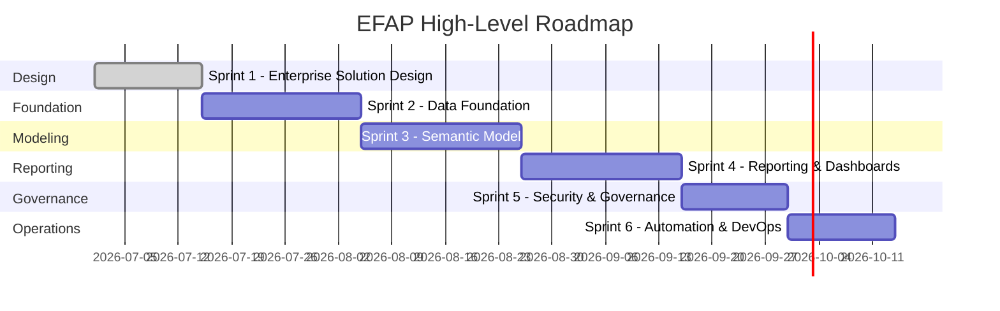

# Project Roadmap

> **Project:** Enterprise Financial Analytics Platform (EFAP)  
> **Document ID:** SD-11  
> **Version:** 1.0  
> **Status:** Approved  
> **Owner:** BI Solution Architect  
> **Last Updated:** July 2026

---

# Navigation

⬅️ Previous: [Deployment Architecture](10_Deployment.md)

➡️ Next: [Architecture Overview](12_Architecture_Overview.md)

---

# Document Control

| Field | Value |
|--------|--------|
| Document Name | Project Roadmap |
| Document ID | SD-11 |
| Version | 1.0 |
| Status | Approved |
| Owner | BI Solution Architect |
| Classification | Internal |

---

# Revision History

| Version | Date | Author | Description |
|---------|------|--------|-------------|
| 1.0 | July 2026 | Ondřej Seidl | Initial version |

---

# 1. Purpose

This document defines the implementation roadmap for the Enterprise Financial Analytics Platform (EFAP).

It provides a structured delivery plan from solution design through implementation, testing, deployment, and future enhancements.

---

# 2. Project Vision

The vision of EFAP is to deliver a scalable, maintainable, and enterprise-grade financial analytics platform that supports:

- Financial controlling
- Budgeting and forecasting
- KPI monitoring
- Executive reporting
- Self-Service BI
- Data governance

---

# 3. Project Timeline

---

# 4. Sprint Overview

| Sprint | Objective | Key Deliverables | Status |
|----------|-----------|------------------|--------|
| Sprint 1 | Enterprise Solution Design | Architecture, Documentation, ADR | ✅ Completed |
| Sprint 2 | Data Foundation | Sample Data, ETL, Validation | ⏳ Planned |
| Sprint 3 | Semantic Model | Star Schema, DAX Measures | ⏳ Planned |
| Sprint 4 | Reporting & Dashboards | Power BI Reports, KPI Dashboards | ⏳ Planned |
| Sprint 5 | Security & Governance | RLS, Governance, Testing | ⏳ Planned |
| Sprint 6 | Automation & DevOps | CI/CD, Monitoring, Releases | ⏳ Planned |

---

# 5. Deliverables by Sprint

## Sprint 1 – Enterprise Solution Design

Deliverables:

- Project documentation
- Architecture design
- Source system analysis
- Data model
- Business rules
- KPI catalog
- ETL design
- Security model
- Deployment architecture
- Architecture Decision Records (ADR)

---

## Sprint 2 – Data Foundation

Deliverables:

- Sample financial datasets
- Power Query ETL
- Data validation
- Staging layer
- Processed datasets

---

## Sprint 3 – Semantic Model

Deliverables:

- Star Schema implementation
- Relationships
- DAX measures
- Time Intelligence
- Performance optimization

---

## Sprint 4 – Reporting & Dashboards

Deliverables:

- Executive dashboard
- Financial dashboard
- Budget vs Actual dashboard
- Profitability dashboard
- Operational reporting

---

## Sprint 5 – Security & Governance

Deliverables:

- Dynamic Row Level Security
- Permission model
- Governance documentation
- Data quality monitoring

---

## Sprint 6 – Automation & DevOps

Deliverables:

- Git workflow
- Deployment automation
- Release management
- Monitoring
- Operational documentation

---

# 6. Definition of Done

Each sprint is considered complete when:

- Deliverables are implemented.
- Documentation is updated.
- ADRs are created where required.
- Solution is tested.
- Code is committed to Git.
- Business validation is completed.

---

# 7. Risks

| Risk | Mitigation |
|------|------------|
| Poor data quality | Data validation rules |
| Scope changes | Controlled change management |
| Performance issues | Performance optimization and testing |
| Security misconfiguration | RLS and security reviews |

---

# 8. Future Enhancements

Potential future capabilities include:

- Microsoft Fabric
- Lakehouse architecture
- Incremental refresh
- AI-assisted financial analysis
- Predictive forecasting
- Scenario planning
- Automated anomaly detection
- Self-Service BI enhancements

---

# 9. Success Criteria

The project will be considered successful when:

- Financial reporting is standardized.
- KPI calculations are consistent.
- Data refresh is automated.
- Security is centrally managed.
- Documentation is complete and maintained.
- The platform is scalable and maintainable.

---

# 10. Related Documents

- [Project Charter](00_Project_Charter.md)
- [Solution Architecture](02_Solution_Architecture.md)
- [Deployment Architecture](10_Deployment.md)
- [Architecture Overview](12_Architecture_Overview.md)

---

# End of Document