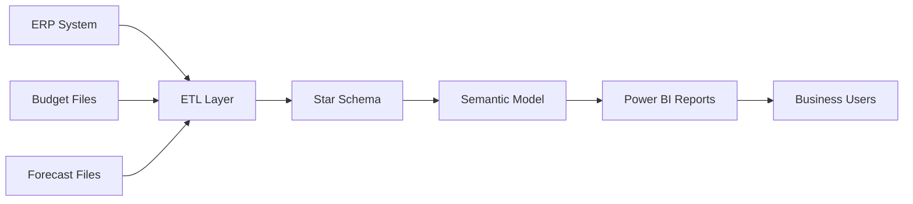
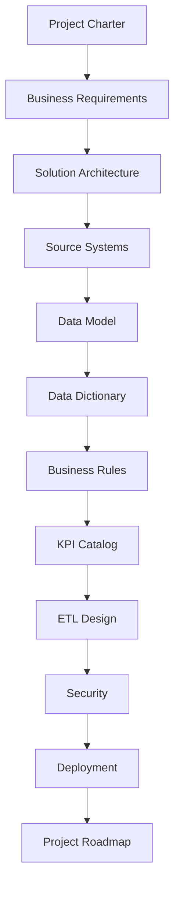

# Enterprise Architecture Overview

> **Project:** Enterprise Financial Analytics Platform (EFAP)  
> **Document ID:** SD-12  
> **Version:** 1.0  
> **Status:** Approved  
> **Owner:** BI Solution Architect  
> **Last Updated:** July 2026

---

# Purpose

This document provides a high-level overview of the Enterprise Financial Analytics Platform (EFAP).

It serves as the primary entry point to the project documentation and summarizes the overall solution architecture, documentation structure, architectural decisions, and implementation roadmap.

---

# Documentation Map

| ID | Document | Purpose |
|----|----------|---------|
| SD-00 | [Project Charter](00_Project_Charter.md) | Project vision and scope |
| SD-01 | [Business Requirements](01_Business_Requirements.md) | Business objectives and requirements |
| SD-02 | [Solution Architecture](02_Solution_Architecture.md) | Overall solution architecture |
| SD-03 | [Source Systems](03_Source_Systems.md) | Source systems overview |
| SD-04 | [Data Model](04_Data_Model.md) | Star schema and data model |
| SD-05 | [Data Dictionary](05_Data_Dictionary.md) | Metadata definitions |
| SD-06 | [Business Rules](06_Business_Rules.md) | Financial calculation rules |
| SD-07 | [KPI Catalog](07_KPI_Catalog.md) | KPI definitions |
| SD-08 | [ETL Design](08_ETL_Design.md) | Data processing architecture |
| SD-09 | [Security and RLS](09_Security_RLS.md) | Security model |
| SD-10 | [Deployment](10_Deployment.md) | Deployment architecture |
| SD-11 | [Project Roadmap](11_Project_Roadmap.md) | Delivery roadmap |

---

# Overall Architecture



---

# Documentation Flow



---

# Architecture Layers

| Layer | Description |
|--------|-------------|
| Source Systems | ERP, Budget, Forecast |
| ETL Layer | Extraction, Transformation, Validation |
| Data Model | Star Schema |
| Semantic Layer | DAX Measures and KPI Model |
| Reporting Layer | Power BI Reports |
| Security Layer | Dynamic Row Level Security |
| Deployment Layer | Dev / Test / Production |

---

# Architecture Decisions (ADR)

| ADR | Title | Status |
|-----|-------|--------|
| ADR-001 | Layered Architecture | Accepted |
| ADR-002 | Star Schema | Accepted |
| ADR-003 | Dynamic Row Level Security | Accepted |

---

# Repository Structure

```text
EFAP/
│
├── Documentation/
├── Data/
├── ETL/
├── PowerBI/
├── Scripts/
├── Tests/
└── README.md
```

---

# Current Project Status

| Area | Status |
|------|--------|
| Business Analysis | ✅ Completed |
| Solution Architecture | ✅ Completed |
| Data Model | ✅ Completed |
| Business Rules | ✅ Completed |
| KPI Definition | ✅ Completed |
| ETL Design | ✅ Completed |
| Security Design | ✅ Completed |
| Deployment Design | ✅ Completed |
| Sprint 1 | ✅ Completed |

---

# Next Phase

The next implementation phase focuses on building the technical solution:

- Data ingestion
- Power Query development
- Semantic model implementation
- DAX measures
- Power BI reports
- Testing and validation

---

# References

- [ADR Folder](ADR/)
- [Templates](Templates/)
- [Images](Images/)
- [Project README](../README.md)

---

# End of Document