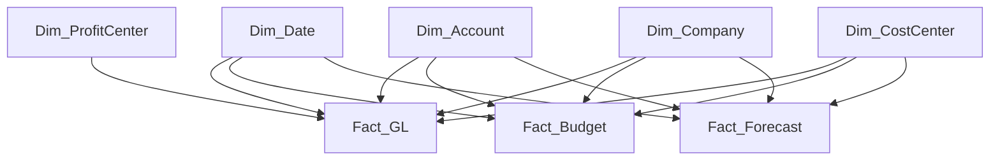

# ADR-002 – Star Schema

> **Project:** Enterprise Financial Analytics Platform (EFAP)  
> **Status:** Accepted  
> **Date:** July 2026  
> **Decision Owner:** BI Solution Architect

---

# Status

Accepted

---

# Context

The Enterprise Financial Analytics Platform requires a data model capable of supporting financial reporting, budget analysis, forecasting, and management dashboards.

The solution must provide:

- consistent financial reporting,
- high analytical performance,
- reusable business logic,
- simple integration with Power BI,
- scalable expansion for future requirements.

Several data modeling approaches were considered, including:

- normalized relational models,
- flat reporting tables,
- dimensional modeling.

---

# Decision

The solution will use a **Star Schema data model** for the analytical layer.

The model will separate:

- **Fact tables** containing measurable business transactions.
- **Dimension tables** containing descriptive attributes used for analysis.

The initial model will contain:

## Fact Tables

- Fact_GL
- Fact_Budget
- Fact_Forecast

## Dimension Tables

- Dim_Date
- Dim_Account
- Dim_Company
- Dim_CostCenter
- Dim_ProfitCenter
- Dim_Currency

---

# Architecture Diagram

---

# Alternatives Considered

## Alternative 1 – Single Flat Reporting Table

**Description**

All financial information stored in one wide table.

**Rejected because:**

- Poor scalability.
- Duplicate attributes.
- Lower maintainability.
- Difficult business logic reuse.

---

## Alternative 2 – Fully Normalized Relational Model

**Description**

Traditional normalized database structure.

**Rejected because:**

- More complex analytical queries.
- Less suitable for Power BI semantic models.
- More relationships required.

---

# Consequences

## Positive

- Optimized analytical performance.
- Simple Power BI relationships.
- Easier DAX development.
- Clear separation of business entities.
- Scalable architecture.

## Negative

- Requires proper dimension management.
- Additional ETL logic for dimension loading.
- More initial design effort.

---

# Implementation Guidelines

The following rules apply:

- Facts contain numeric business measurements.
- Dimensions contain descriptive attributes.
- Relationships should normally be one-to-many.
- Filtering direction should remain controlled.
- Business calculations belong in the semantic model.

---

# Related Documents

- 02_Solution_Architecture.md
- 04_Data_Model.md
- 05_Data_Dictionary.md
- 07_KPI_Catalog.md

---

# References

- ADR-001 – Layered Architecture

---

**End of ADR**