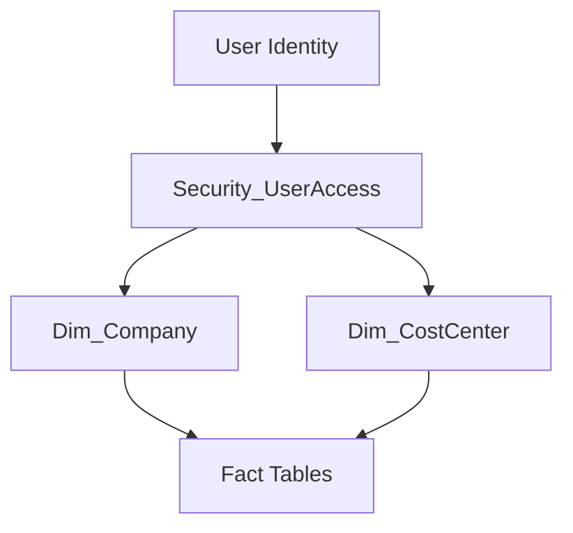

# ADR-003 – Dynamic Row Level Security Model

> **Project:** Enterprise Financial Analytics Platform (EFAP)  
> **Status:** Accepted  
> **Date:** July 2026  
> **Decision Owner:** BI Solution Architect

---

# Status

Accepted

---

# Context

The Enterprise Financial Analytics Platform contains sensitive financial information.

Different users require different levels of access based on:

- company,
- cost center,
- region,
- organizational responsibility.

A scalable security model is required to avoid maintaining individual report filters.

---

# Problem Statement

The solution must support:

- multiple companies,
- multiple user roles,
- changing organizational structures,
- centralized permission management,
- auditability.

Static security assignments are not sufficient for an enterprise solution.

---

# Decision

The platform will implement a **Dynamic Row Level Security (RLS) model**.

Access rights will be managed through a centralized security mapping table.

The user's identity will determine allowed data scope dynamically.

---

# Security Architecture

---

# Security Mapping Table

The solution will use:

## Security_UserAccess

| Column | Purpose |
|-|-|
| User_Email | User identification |
| Role | Security role |
| Company_Key | Allowed company |
| CostCenter_Key | Allowed cost center |
| Region | Allowed region |

---

# Alternatives Considered

## Alternative 1 – Static Roles

Description:

Manually assign access filters inside reports.

Rejected because:

- difficult maintenance,
- poor scalability,
- higher administration effort.

---

## Alternative 2 – Dynamic RLS

Description:

Permissions stored as data.

Accepted because:

- scalable,
- auditable,
- easier administration,
- supports enterprise growth.

---

# Consequences

## Positive

- Centralized security management.
- Easy user onboarding.
- Supports multiple organizational structures.
- Reduced report maintenance.

## Negative

- Requires security master data management.
- Requires regular access reviews.

---

# Implementation Guidelines

The following rules apply:

- Default access is denied.
- Permissions must be explicitly assigned.
- Security filtering happens in the semantic model.
- Users must not bypass RLS rules.

---

# Related Documents

- [09 - Security and RLS](../09_Security_RLS.md)
- [04 - Data Model](../04_Data_Model.md)

Related ADRs:

- [ADR-001 - Layered Architecture](ADR-001-Layered-Architecture.md)
- [ADR-002 - Star Schema](ADR-002-Star-Schema.md)

---

# End of ADR